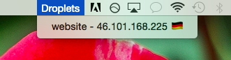

# droplist
Tiny list of your Digital Ocean droplets from the system tray.

## About
This is a toy project for using Go and the Digital Ocean developers API.

Current functionality includes:
* Listing a single droplet by name, IP address, and showing a cute emoji flag that represents the droplet's datacenter.
* Clicking on the item in the menu will open the droplet's page on cloud.digitalocean.com in your web browser.

### Planned features:
* Listing all droplets
* An icon in the system tray instead of the word
